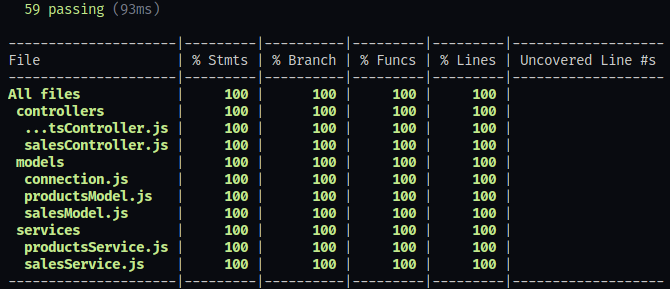
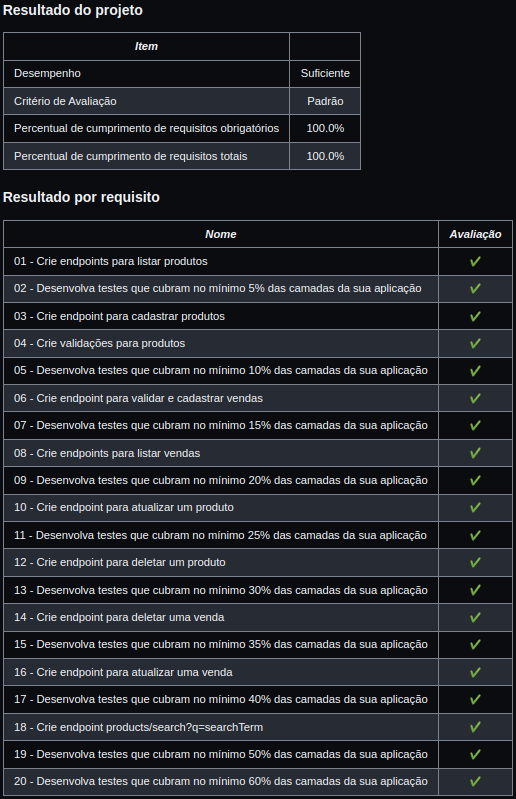

# Store Manager :department_store:

 :brazil:

Versão em Português

## Objetivo

Construir uma API para gerenciar o banco de dados de estoque e vendas de uma loja que:

- usa uma interface uniforme e os métodos do protocolo de rede GET, POST, PUT e DELETE;
- é baseada em cliente-servidor;
- tem operações sem estado;
- faz uso de um sistema em camadas.

## Observações

Essa aplicação não usa recursos armazenáveis em cache, então ainda não é bem um app RESTful.  
Ela foi desenvolvida utilizando o banco de dados MySQL e pacotes Node.js como express, express-rescue, mysql2, mocha, chai, chai-as-promised e sinon.  
A arquitetura de software foi construida usando o padrão Model-Service-Control.

 :us:

English Version

## Objective

To build an API for managing the database of a store's stock and sales that:

- uses an uniform interface and the methods of the network protocol GET, POST, PUT and DELETE;
- is client-server based;
- has stateless operations;
- makes use of a layered system.
   

## Observations

This application doesn't use cacheable resources, so it's not quite a RESTful app.  
It was developed using MySQL database and Node.js packages such as express, express-rescue, mysql2, mocha, chai, chai-as-promised e sinon.  
The software architecture was built following the Model-Service-Control standard.

## Test coverage / Cobertura de testes

## Approved requirements / Requisitos aprovados

